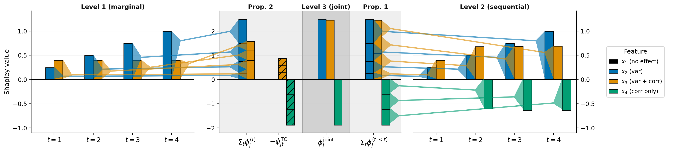

# 📐 A Hierarchy of Entropy-Shapley Games for Multivariate Predictive Uncertainty

Reproduction code for the paper *A Hierarchy of Entropy-Shapley Games for
Multivariate Predictive Uncertainty*. Each notebook/script reproduces one
figure in Section 5 (or Appendix D) of the paper.

<p align="center">
  
  <br/>
  <sub><b>Figure 1</b> — three entropy-Shapley games on a synthetic Gaussian DGP.
  <code>x₁</code> only drives the mean → zero attribution at every level;
  <code>x₄</code> only drives the cross-component correlation → invisible at
  Level 1 but dominant in the cross-component term.</sub>
</p>

## 🪜 The hierarchy in one glance

The paper introduces three entropy-based Shapley games that differ only in
how they treat dependencies between output components. For an ordered
multivariate output $\mathbf{Y} = (Y_1, \dots, Y_T)$:

| Level | Value function                              | Captures                                            |
|-------|---------------------------------------------|-----------------------------------------------------|
| L1    | $H(Y_t \mid \mathbf{x}_S)$                  | marginal entropy at each output component $t$       |
| L2    | $H(Y_t \mid Y_{<t}, \mathbf{x}_S)$          | sequential conditional entropy (chain-rule step)    |
| L3    | $H(\mathbf{Y} \mid \mathbf{x}_S)$           | joint entropy over the full output vector           |
| Cross | $\sum_t \phi^{(t)} - \phi^{\text{joint}}$   | total-correlation / cross-component decomposition   |

By construction **L3 = $\sum_t$ L2** (Proposition 1), and the
cross-component attribution recovers the deviation of the local total
correlation from its population average (Proposition 2).

## 📦 Setup

```bash
uv sync
```

This pins NumPy 2.x / SciPy 1.14+ / PyTorch 2.5+ via `tool.uv.override-dependencies`
and uses the CUDA 12.4 PyTorch wheel index. CPU-only installs work as well —
the notebooks fall back automatically — but `4_main_comparison.py` and
`5_deepar_validation.py` are GPU-bound for trajectory sampling. A single
modern GPU with ≥ 24 GB memory is sufficient for the full pipeline.

## 🔁 Reproducing the figures

Run the steps in order. Caches under `results/` and `models/` make re-runs
cheap; runtimes below are for cold first runs on a single GPU.

- 🎯 **Figure 1** — *Synthetic Gaussian DGP (§5.1).*
  Run `notebooks/1_synthetic_dgp.ipynb` top-to-bottom (<1 min).
  → `plots/5_1/synthetic_hierarchy.pdf`

- 🚲 **Figure 2 + Figs D.2 / D.3** — *Bike Sharing NGBoost (§5.2 + App. D.2.1).*
  Run `notebooks/2_bikesharing_ngboost.ipynb` (~10 min).
  → `plots/5_2/bikesharing_hierarchy.pdf`, `shap_vs_es.pdf`

- 🤖 **Prerequisite** — *DeepAR pre-training (used by Figures 3 and D.4).*
  Run `python notebooks/3_train_deepar.py` (<1 min if stored models are used; ~2 h retraining three likelihoods).
  → `models/deepar_{normal,studentt,lognormal}.ckpt`

- 📊 **Figure 3** — *DeepAR vs. Chronos main comparison (§5.3).*
  Run `python notebooks/4_main_comparison.py` (~2 h). Chronos is loaded
  zero-shot from Hugging Face on first call.
  → `plots/5_3/main_comparison_boxplot.pdf`, `forecast_appendix.pdf`

- 🔬 **Figure D.4** — *DeepAR estimator validation (App. D.3.1).*
  Run `python notebooks/5_deepar_validation.py` (~3 h).
  → `plots/5_3/combined_L2_appendix.pdf`, `combined_L3_appendix.pdf`

The core library lives in `entropy_shapley/`. Files are named after the
paper section they instantiate — `game.py` (Sec. 4.1), `imputer.py`
(Sec. 4.2.1 + 4.2.2), `estimators.py` (Sec. 4.2.3) — plus supporting
utilities for the electricity-dataset pipeline. Open any of the
notebooks/scripts above to see which library functions feed into which
figure.

## 📚 Datasets

* [**UCI Bike Sharing**](https://doi.org/10.24432/C5W894) (Fanaee-T, 2013) — hourly rentals; aggregated into
  $T = 8$ two-hour blocks over 06:00–22:00. CC BY 4.0.
* [**UCI Electricity Load Diagrams 2011–2014**](https://doi.org/10.24432/C58C86) (Trindade, 2015; Xiong, 2024
  preprocessed snapshot from the package `gluonts`) — hourly load per series; aggregated into $T = 12$ two-hour blocks per day, restricted to the first 100 series.
  CC BY 4.0.

Both files are bundled in `datasets/` for offline reproducibility.
